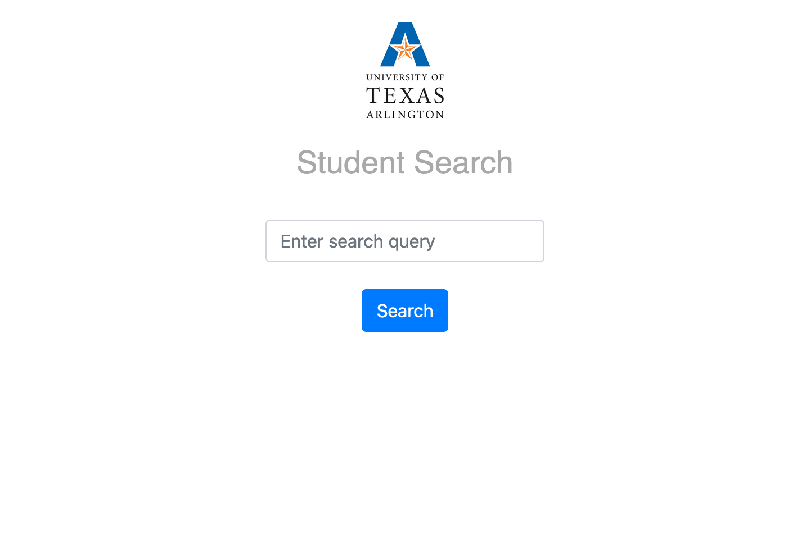
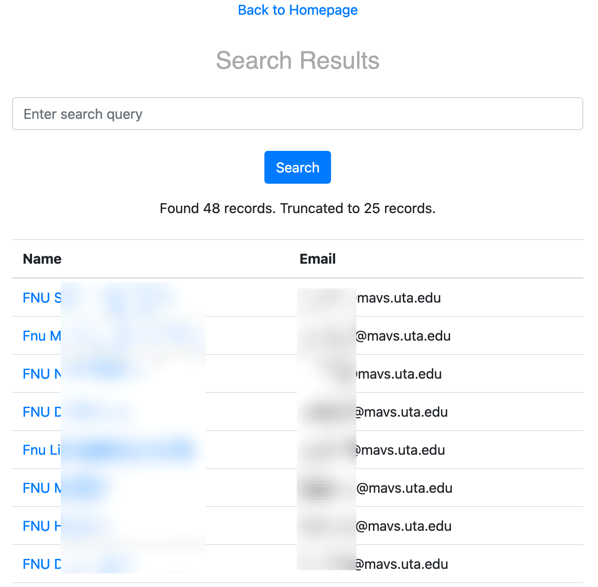
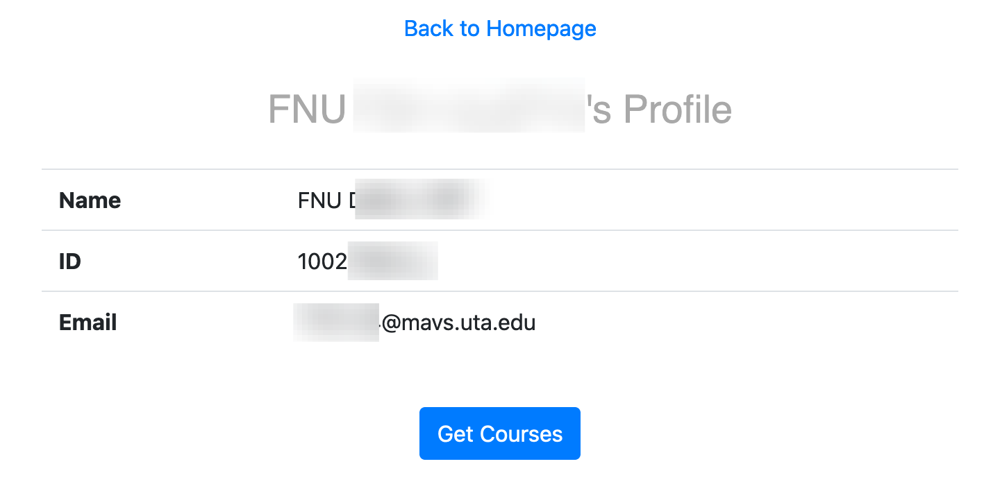
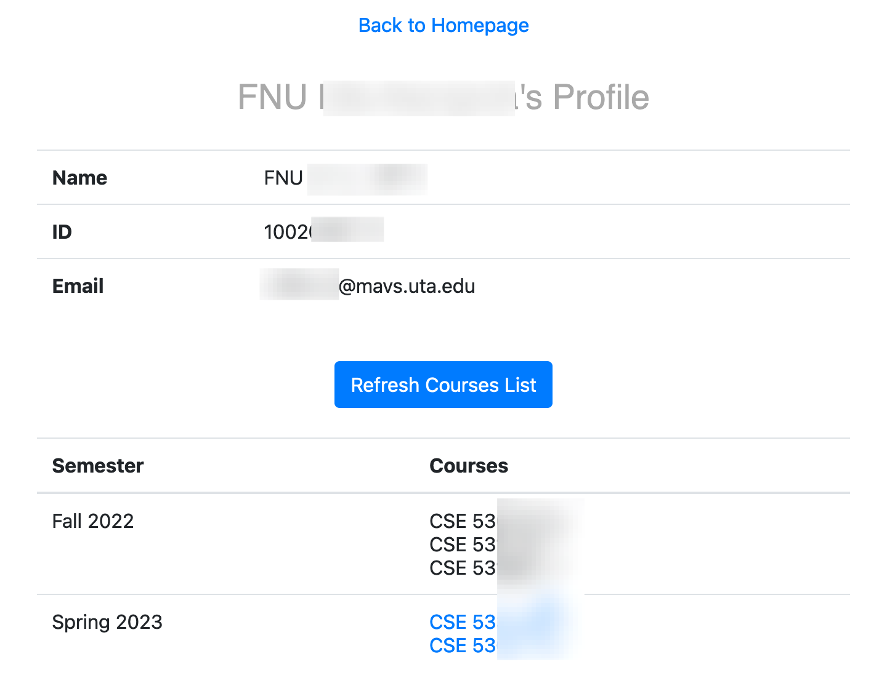
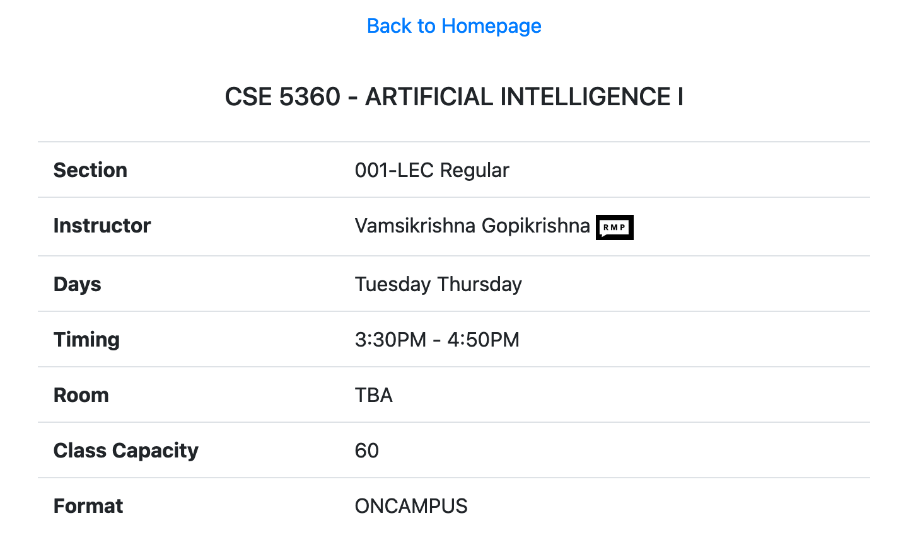

# Student Course Search System

A web application to search for students and their courses

## Features

- Search for courses by student name, student ID, or student email
- View a list of students that match the search criteria
- Get a list of courses registered for a specific student
- Refresh the list of registered courses
- View detailed course information including instructor name, timing, location
- Query [RateMyProfessors](https://www.ratemyprofessors.com/) website with the instructor name

## Requirements

- Python 3
- Flask
- PyMongo
- Others (See all in requirements.txt)

## Installation

- Clone the repository: `https://github.com/ahmed-797/uta-student-search.git`
- Navigate to the project directory: `cd repo`
- Install the required packages: `pip install -r requirements.txt`

## Usage

- Run the application: `flask run`
- Go to http://localhost:5000 in your web browser
- Search for students by entering a student name, student ID, or student email in the search bar

- View the search results and click on the student to view more detailed information

- You can view your courses list by clicking on the "Get Courses" button

- If the student has active registered classes, they will be fetched and printed

- You can get the updated classes list by clicking on the "Refresh Courses" button

- If the course is underlined (has a hyperlink), click on that course to know more information about that course

